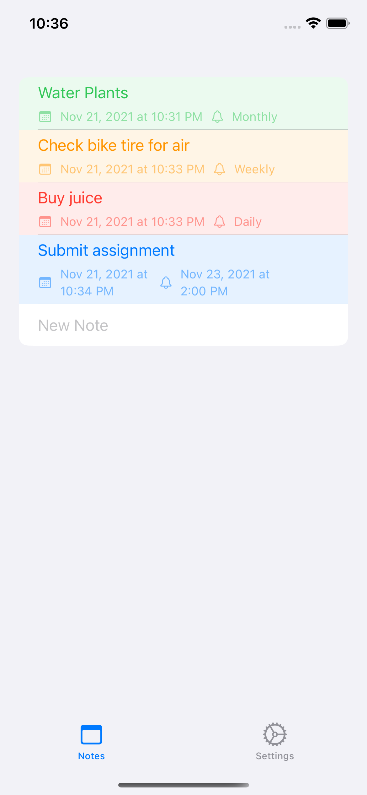
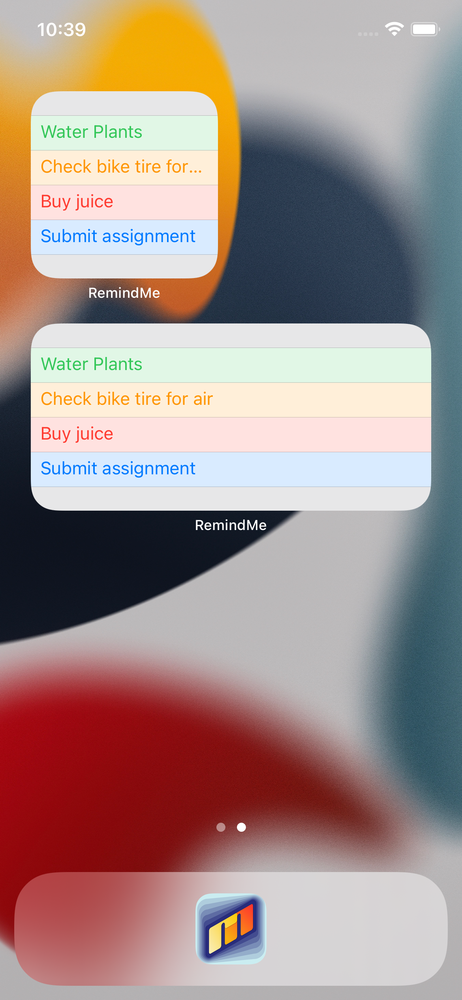
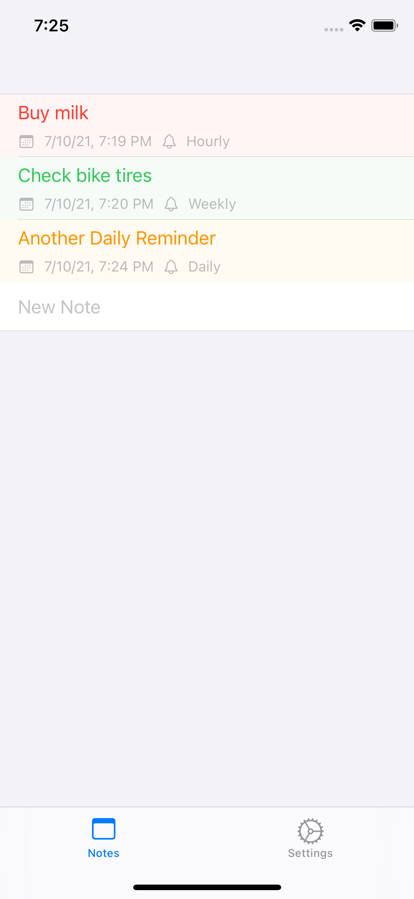
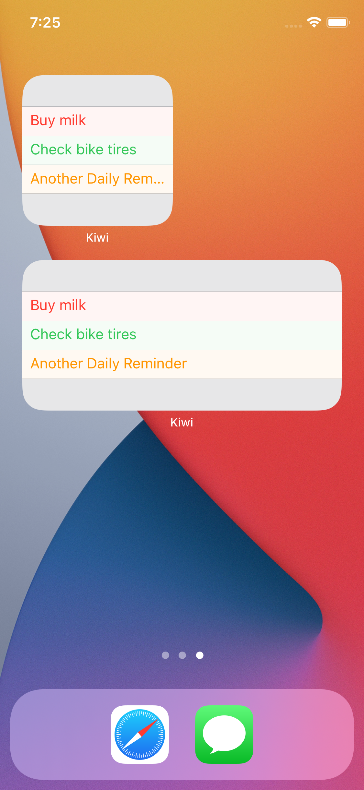

# RemindMe
Experimenting with a Note-Taking app in SwiftUI

## Version Beta 1.0
- available as Testflight, soon in AppStore (hopefully)

| Notes | Settings | Widgets | Notifications |
|-|-|-|-|
|  |  |  |  |

## Version Beta 0.5
- currently available as Testflight beta

| Notes | Settings | Widgets | Notifications |
|-|-|-|-|
|  |  |  |  |
